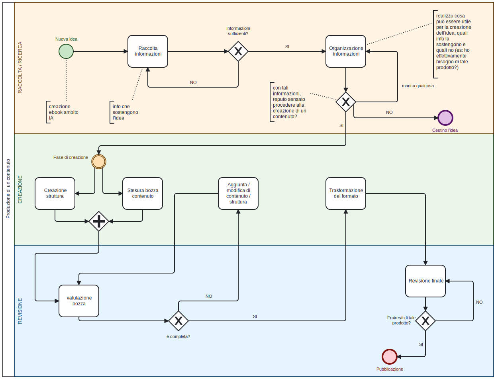

  
`` Università degli Studi di Milano ``
`` Corso di Editoria Digitale`` 
`` Anno accademico 2022/2023``
`` Emanuele Peratello 910983`` 

# Relazione Progetto Editoria digitale 
## Introduzione
Questo progetto è nato dall'idea di aiutare il nuovo pubblico (in particolare quello italiano) che si interessa all'**intelligenza artificiale**[^1],siccome assisteremo alla crescita del settore nei prossimi anni anche qui, in Italia[^2].
Il contenuto in questione è un testo che **permetta la comprensione** dell'argomento senza conoscenze pregresse, rendendo l'utente in grado di orientarsi nella vasta mole di informazioni che esistono non solo in rete ma anche in bibliografia.[^3]
Perchè partire da **markdown**? Perchè è uno dei formati ad oggi più portabili, e consente una stesura testuale minimale.
Il formato *epub* è il formato di interscambio più usato per libri elettronici e dunque il mio punto di partenza per **distribuire** e raggiungere più persone possibili. 
Infine essendo materiale digitale, consente di introdurre collegamenti a repository **github** contenenti dei**jupiter notebook**.

## Obiettivi 
L'obbiettivo principale di **Surfing AI** è quello di creare un testo di **facile fruizione** che permetta ai novizi di apprendere attraverso un buon livello di astrazione degli argomenti e di entrare poi più nel dettaglio. Il principale problema della disciplina per un **neofita** (autodidatta come lo sono stato io per la tesi) è la vasta quantità di materiale che rende difficoltoso l'**orientarsi**, per via di testi molto dettagliati o piuttosto vaghi. 
Va fatta la considerazione che per quanto studiare su carta sia indubbiamente più efficace, un formato come **epub** presenta il vantaggio di agevolarne il "**broadcasting**" ed essere supportato da svariati dispositivi. 
Inoltre data la consistente quantità di argomenti affrontati, un libro cartaceo raggiungerebbe una dimensione notevole, con un **formato digitale** non si ha limitazioni, e tramite *indice* e *funzione cerca* degli e-reader è più semplice trovare gli argomenti.
Sono stati implementati **vari accorgimenti** per facilitare la lettura (font, layout, colori ), e metadati in Dublin Core.  
## Processo di produzione
il processo di produzione ha incluso:
#### Studio e Analisi del tema
Il campo dell'IA è ricco di libri e articoli online che spiegano pressochè qualsiasi cosa. La maggior parte del materiale online è in lingua inglese, e il settore sta crescendo in tutto il mondo, con un po' di ritardo crescerà anche qui in Italia.
Ho individuato quindi una mancanza di materiale in italiano, utile soprattutto per chi inizia da zero, e (*spero*) la futura crescita del settore, quindi una maggiore richiesta di materiale al fine di formarsi. 
#### Studio competitor 
in questo caso piuttosto che competitor, parlo di alternative, che però appunto sono generalmente più specifiche in ambiti come il Machine Learning e difficilmente citano il campo della XAI (Expleinable Artificial Intelligence)
#### Definizione del target 
Tutti coloro che intendono avvicinarsi alla disciplina, anche senza esperienza pregressa. *Ho fatto di quel che era un mio bisogno il prodotto per chiunque si trovi nella stessa situazione*, un testo a libero accesso.
#### Definizione dei canali e licenze di distribuzione
Idealmente il prodotto nasce per sotto **licenza libera**. la prima pagina dell'ebook cita la protezione del materiale dal diritto d'autore, ma per puro scopo estetico. 
#### Definizione dei formati
**markdown** per la stesura del testo
**epub3**  come formato finale (eventualmente poi trasformarlo in formati proprietari)
#### Stesura bozza
#### Revisione dei contenuti

#### Implementazione delle revisioni 

#### Definizione dello stile grafico
il css del ebook è stato convalidato con il tool del W3C. l'organizzazione grafica e dei colori è pensata per non appesantire la vista ed essere facilmente leggibile. (dalle informazioni del corso di Visualizzazione Scientifica).
#### Creazione del formato di distribuzione
#### Revisione manuale del documento
la revisione del contenuto appena dopo la trasformazione ha prodotto dei cambiamenti e adattamenti. (***alcuni errori sono stati lasciati appositamente per mostrare i limiti della tecnologia***)

## Gestione documentale
Segue lo schema bpmn che descrive i processi che hanno permesso di realizzare **Surfing AI**. *Viene fatto notare che per rendere lo schema facilmente leggibile non sono state introdotte particolari informazioni riguardo i processi, in quanto, qui di seguito, verranno approfonditi.*

- **Nuova idea**
la realizzazione di un progetto parte dall'idea dell'autore, per cui si approfondisce attraverso una raccolta di informazioni, e si valuta se sia un'idea realizzabile e sensata.
- **Creazione struttura**
qui ho realizzato la struttura dell' ebook (capitoli, sottocapitoli, note, indice analitico), definito il file dei metadati descrittivi, e pensato allo stile grafico. (poi corretto in revisione)
- **Valutazione bozza** 
solo nel momento in cui la bozza mi è apparsa completa ho trasformato il formato.
 - **Trasformazione del formato**
 in questa fase il formato è stato trasformato da markdown a epub3 attraverso pandoc, inserendo in questa fase i metadati in Dublin Core.
 - **Revisione finale**
nella revisione finale, attraverso l'editor Sigil, ho ritoccato gli errori commessi con la trasformazione, e ho messo mano al css per raggiungere il layout desiderato. 
(*ho solo scoperto in seguito che in base all'-e-reader lo stile grafico viene automaticamente modificato*)

## Tecnologie adottate
Segue il link al repository dove all'interno del file `README.md` spiego il codice.
[repository github](https://github.com/EmaThatBoi/Progetto-Editoria-Digitale)

Tecnologie adottate: 
- Markdown
- epub3
- Css3
- Pandoc
- [Sigil](https://sigil-ebook.com/sigil/download/)
- Chrome e-reader, [e-reader online](https://epub-reader.online/) e app Android e-reader Prestigio
- GitHub

## Conclusioni
E' importante notare che **il risultato finale, dipende dall' e-reader** che utilizziamo. L'e-reader su android imposta un suo stile grafico (poco niente rimane del mio Css), mentre quello di Chrome per quanto ne rovini il layout, rispetta i colori e i font. 
Il foglio di stile **Css** è convalidato secondo il **W3C**, e l'ebook è **ben formato**.
Ho lasciato degli errori in quanto è interessante vedere come la trasformazione abbia generato delle **incongruenze**, in particolare nelle Note e nelle formule matematiche. (è possibile ridurre i difetti attraverso l'editor).
La bibliografia avrei dovuto inserirla manualmente in quanto la trasformazione ha generato le note a piè di pagina. 
Altri errori minori sono stati corretti attraverso l'editor.

**Sigil** possiede un editor minimale per quanto riguarda la notazione matematica. 
Trovo soddisfacente la gestione delle note a piè di pagina per quanto non come era programmato. 

Riguardo l'**automazione** nella trasformazione dei formati e nell'inserimento dei metadati e della formattazione css, non ho avuto difficoltà pur non avendo particolare esperienza.

## Bibliografia e sitografia
[^1]: non essendo un utente esperto di IA posso limitarmi ad accennare nel materiale del progetto il machine learning. 
Perchè utilizzare - *intelligenza artificiale* - anzichè  - *machine learning* - ? Perchè il primo termine è ben **più conosciuto**, anche se il machine learning ne è solo una parte. 
[^2]:https://www.ilsole24ore.com/art/intelligenza-artificiale-2022-crescita-22percento-700-milioni-2025-AEzvvYkC
[^3]:facendo ricerca del possibile materiale di studio in rete si viene incontro ad un'importante quantità di testi, però spesso suddivisi tra testi indirizzati a studenti universitari e testi piuttosto blandi.

